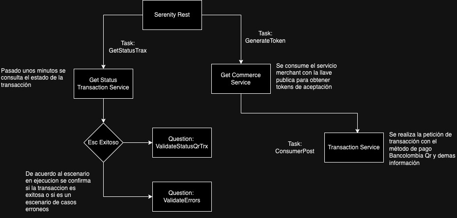

# En esta automatización se utiliza

# Patron de diseño:
ScreenPlay

# Frameworks:
Serenity Rest

# Plugin 
ScreenPlay Architecture
https://github.com/jumosqu12/ScreenplayArchitecture

# Comando de ejecucion 
./gradlew clean test o Usar Junit

# Arquitectura de prueba y servicios

# Gherkin
Se utiliza Gherkin como lenguaje de desarrollo de las funcionalidades dado que es un lenguaje comprensible por humanos y por ordenadores, con el vamos a definir el comportamiento de la página que vamos a automatizar. Se trata de un lenguaje fácil de leer, fácil de entender y fácil de escribir. Utilizar Gherkin nos va a permitir crear una documentación viva a la vez que automatizamos los tests, haciéndolo además con un lenguaje que puede entender negocio. Lo bueno de Gherkin es que para empezar a hacer BDD sólo nos hace falta conocer 5 palabras, con las que construiremos sentencias con las que vamos a describir las funcionalidades:

# Feature
Indica el nombre de la funcionalidad que vamos a probar. Debe ser un título claro y explícito. Incluimos aquí una descripción en forma de historia de usuario: “Como [rol] quiero [característica] para que [los beneficios]”. Sobre esta descripción empezaremos a construir nuestros escenarios de prueba.

# Scenario Outline
Describe cada escenario que vamos a probar.

# Given
Provee contexto para el escenario en que se va a ejecutar el test, tales como punto donde se ejecuta el test, o prerequisitos en los datos. Incluye los pasos necesarios para poner al sistema en el estado que se desea probar.

# When
Especifica el conjunto de acciones que lanzan el test. La interacción del usuario que acciona la funcionalidad que deseamos testear.

# Then
Especifica el resultado esperado en el test. Observamos los cambios en el sistema y vemos si son los deseados. Lo normal es probar distintos escenarios para comprobar una determinada funcionalidad. De esta forma vamos a pasar de nuestras historias de usuario a pruebas de comportamiento automatizables.

serenity-cucumber-gradle-screenplay
Se emplea el uso del patrón screenplay con cucumber y gradle.

Serenity que utiliza los resultados de las pruebas para realizar la documentación describiendo que lo que hace la aplicación, informa que pruebas se han realizado, las pruebas que fallaron y las que pasaron.

Screenplay está centrado en el usuario y orientado a tareas, utiliza los principios S.O.L.I.D.

Con screenplay se puede escribir el código en un lenguaje más natural.

Gradle: Es un gestor de proyectos.

Features de la automatización
Transaction

features/payment_transaction_with_qr.feature
payment_transaction_with_qr_error.feature

# Runner
Es el ejecutor de los features, tags, glue (donde se encuentra el step definition), URL del driver y la conexión con Excel del drive.

# Stepdefinitions
Son la traducción de los features a código. Los métodos que se utilizaran son los features (historias de usuario).

# Task
Clases que representan tareas que realiza el actor a nivel de proceso de negocio.

# Interaction
Clases que representan interacciones de una acción directa del usuario con la interfaz.

# Question
Comprueban los resultados de las operaciones realizadas.

# User Interface
Mapean los componentes de una interfaz de usuario.

# Util
Clases que están relacionadas con las utilidades de dominio.

# Model
Clases donde se encuentran los objetos complejos de negocio.

# Exceptions
Son las excepciones que se visualizan cuando un test falla o tiene errores.

# Requerimientos
Java JDK > 11
Gestor de proyectos Gradle
